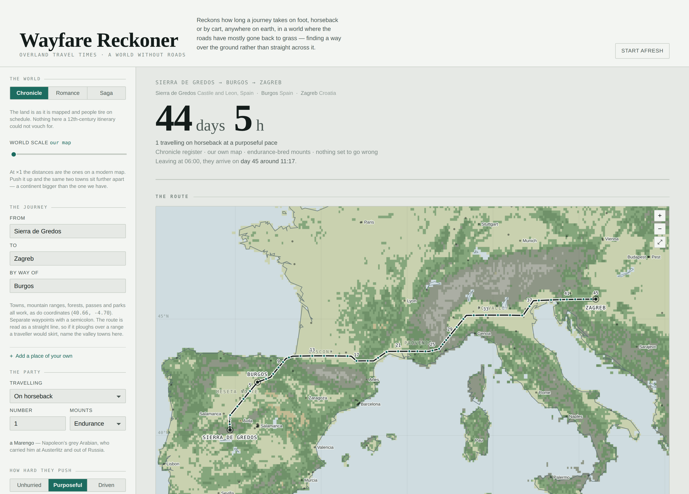

# Wayfare Reckoner

**How long does it take to get there, on foot or on horseback, in a world where the roads have gone back to grass?**

Give it two places anywhere on earth. It finds a way over the actual ground — around the seas, along the valleys, through the passes — reads the terrain it crosses, decides how far a party can push in a day, and comes back with days and hours plus a night-by-night itinerary.

It was built for a de-modernised Europe: a few surviving paved roads, cart tracks, and a great deal of wilderness between the Iberian Peninsula and the Hungarian plain. It now covers the whole world at the same grain.



## Try it

**The app** — open `index.html` in any browser. No server, no install, no network: the gazetteer, the terrain grid and the coastline are all carried inside the file, which is why it is about ten megabytes.

**On the web** — because the app is `index.html` at the top of the repo, turning on GitHub Pages publishes it as-is. See [Publishing it](#publishing-it) below.

**The command line** — needs Python 3, nothing else:

```bash
python3 cli/wayfare.py --from Lyon --to Zagreb --mode horse --rest medium
python3 cli/wayfare.py --from "Sierra de Gredos" --to Berlin --mode foot --rest low --season winter
python3 cli/wayfare.py --from Split --to Ancona --boat ferries --json
```

## What you can set

| | |
|---|---|
| **Where** | any of 170,932 settlements, plus ranges, parks, forests and passes — or bare coordinates, or a place you invent |
| **How they travel** | on foot, on foot laden, on horseback, with remounts, or by cart |
| **How hard they push** | unhurried (exploring, a full night's sleep, time to bathe and break camp), purposeful (seven hours' sleep, no daytime rest but watering the horses), or driven (chased, resting as little as they can bear) |
| **Mounts** | ordinary stock, endurance-bred, exceptional bloodstock, or otherworldly — a Rocinante, a Marengo, a Bucephalus, a Shadowfax |
| **The going** | old paved roads, main roads and cart trails, cart trails and drove roads, or pathless country |
| **Weather and season** | ten kinds of weather from clear to deep snow; the season sets the daylight |
| **Boats** | none, ferry crossings at the narrow places, or a ship |
| **Departure** | any clock time, and whether they travel after dark |
| **Party size** | one traveller or an army; a column moves at the pace of its slowest element |
| **Register** | Chronicle, Romance or Saga — how much the world bends toward story |
| **World scale** | ×1 is our map; push it up and the same two towns sit further apart |

## How it works, briefly

**Finding the way.** An A\* search over a land mask at a tenth of a degree — about eleven kilometres — where the cost of a step is distance divided by how fast that ground lets you move. So the search prefers a river valley to a ridge, goes round the Adriatic rather than across it, and reports Madrid to London on foot as impossible rather than quietly walking the Channel.

**Reading the ground.** The route is cut into fifteen-kilometre slices and each is looked up in a terrain grid derived from real elevation. Terrain gives a speed multiplier, a sinuosity factor for the wandering an eleven-kilometre cell cannot see, and an exposure factor for how much the weather bites there.

**Reckoning the days.** Base paces by mode and mount, hours on the move by rest regime, daylight from latitude and season, night travel at a little over half speed, fatigue that converges on a plateau rather than running away, and a separate count of consecutive hard days that forces a halt when the animals or the people are spent. Tuned against six historical benchmarks — the Roman *iter iustum*, Sigeric's pilgrimage rate, sustained mounted travel, couriers with remounts, ox-carts, and an Alpine crossing on foot.

**The two fantasy dials are kept separate on purpose.** *Register* changes how the world behaves — deeper wilds, people who tire less, which mounts are even in the story. *World scale* changes how big the map is. They answer different questions, so neither hides inside the other.

`docs/model.md` has the full derivation: every table, every constant, and why.

## The data

Four files in `data/`, all derived from public datasets:

| File | What it is |
|---|---|
| `places.tsv` | 170,932 places — name, position, region, population, kind, aliases |
| `grids.json` | four 3600 × 1800 grids at 0.1° — land, terrain, region name, walkable landmass — run-length encoded |
| `coastline.json` | 1,055 land rings and 900 lake rings, for drawing |
| `regions_table.json` | the 371 interned "Province, Country" strings |

Terrain is derived rather than drawn: **ruggedness from ETOPO 2022** (mean elevation and local relief per cell), crossed with a **biome layer** — latitude bands, Natural Earth's deserts, and about 340 hand-drawn polygons — because nothing in the available data tells forest from grassland. **Names come from Natural Earth's 1,034 named physical regions**, with the smaller name always beating the larger one it sits inside, then a set of old provincial rectangles for Europe, then the province of the nearest town where nothing else has a name.

The land mask forces open the narrow waters an eleven-kilometre raster welds shut — Gibraltar, the Bosphorus, the Danish belts, Dover, Messina, Bering and fourteen more — and forces shut the canals nobody in this world dug: Suez and Corinth.

### Credits

- **[GeoNames](https://www.geonames.org/)** `cities1000` — licensed [CC BY 4.0](https://creativecommons.org/licenses/by/4.0/)
- **[Natural Earth](https://www.naturalearthdata.com/)** 10m land, lakes and physical region polygons — public domain
- **[ETOPO 2022](https://www.ncei.noaa.gov/products/etopo-global-relief-model)**, NOAA National Centers for Environmental Information — public domain

The GeoNames attribution above travels with the data: anyone redistributing `data/places.tsv`, or the app that carries it, needs to carry the credit too.

## What's in here

```
index.html           the built app — open this, and what GitHub Pages serves
src/                 the app's parts, and build.py which stitches them together
cli/                 the same model in Python, plus its self-test
data/                the four data files both of them read
data-build/          the pipeline that produced data/ from the public datasets
docs/model.md        where every number comes from
SKILL.md             instructions for using this as a Claude skill
.nojekyll            tells GitHub Pages to serve the files as they are
```

Every file here belongs in the repo. Nothing needs building or installing to
use it — `index.html` is the whole app.

## Publishing it

The app is a single static file, so GitHub Pages needs no build step and no
configuration beyond being switched on:

1. Push the repo to GitHub.
2. **Settings → Pages**.
3. Under *Source*, choose **Deploy from a branch**.
4. Branch **main**, folder **/ (root)**. Save.

A minute or two later the app is live at
`https://<your-username>.github.io/<your-repo>/`. It loads the app and not this
README, because Pages serves `index.html` at the bare URL — the README is only
ever shown on the repo's own page.

Two things worth knowing:

- **The page is about 10 MB**, and roughly 3.8 MB over the wire once GitHub
  gzips it. That is a heavy page — think of a photo gallery rather than a blog
  post — but it loads once and then everything is instant, because there is no
  server to go back to.
- **`.nojekyll`** turns off the site generator Pages runs by default. Nothing
  here needs it, and without the file Pages would quietly ignore any file or
  folder whose name begins with an underscore.

## Changing things

**The app.** Edit the parts in `src/`, then:

```bash
python3 src/build.py
```

which rewrites `index.html`. Nothing else is needed — commit it and Pages picks
up the new version on the next push.

**The model.** `cli/wayfare.py` and `src/engine.js` hold the same numbers in two languages. Change one and change the other, or say plainly that only one of them moved.

**The data.** `data-build/README.md` explains the pipeline. You need the source datasets downloaded, and numpy and Pillow installed. This is the slow part and you should not need it unless you want to change how terrain is derived.

## Checking it

```bash
python3 cli/selftest.py
```

About 300 assertions: that pushing harder never arrives later, that every dial moves the answer in the direction it claims to, that the six historical benchmarks still land in range, that every named sea is sea and every named land area is land, and that the terrain grid says something sensible about ground we all know.

## Licence

There isn't one. That means default copyright — the code here is not offered for reuse. The **data** is a separate matter and keeps its own terms whatever happens to the code: GeoNames stays CC BY 4.0, Natural Earth and ETOPO stay public domain.

If you want people to be able to build on this, adding a `LICENSE` file — MIT is the usual choice — is the way to say so.
